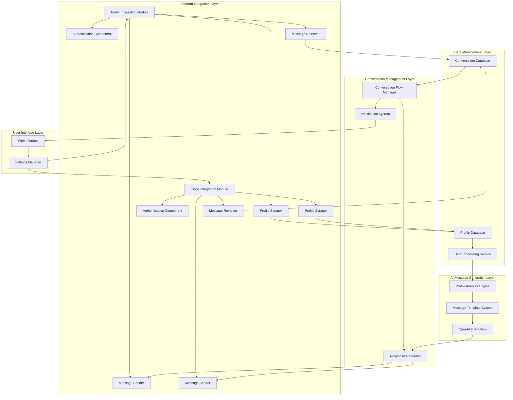

```mermaid
graph TD
    subgraph "Platform Integration Layer"
        A1[Tinder Integration Module]
        A2[Hinge Integration Module]
        A1 --> A1a[Authentication Component]
        A1 --> A1b[Profile Scraper]
        A1 --> A1c[Message Retriever]
        A1 --> A1d[Message Sender]
        A2 --> A2a[Authentication Component]
        A2 --> A2b[Profile Scraper]
        A2 --> A2c[Message Retriever]
        A2 --> A2d[Message Sender]
    end

    subgraph "Data Management Layer"
        B1[Profile Database]
        B2[Conversation Database]
        B3[Data Processing Service]
    end

    subgraph "AI Message Generation Layer"
        C1[Profile Analysis Engine]
        C2[Message Template System]
        C3[OpenAI Integration]
    end

    subgraph "Conversation Management Layer"
        D1[Conversation Flow Manager]
        D2[Response Generator]
        D3[Notification System]
    end

    subgraph "User Interface Layer"
        E1[Web Interface]
        E2[Settings Manager]
    end

    %% Inter-layer connections
    A1b --> B1
    A2b --> B1
    A1c --> B2
    A2c --> B2
    B1 --> B3
    B3 --> C1
    C1 --> C2
    C2 --> C3
    B2 --> D1
    D1 --> D2
    C3 --> D2
    D2 --> A1d
    D2 --> A2d
    D1 --> D3
    D3 --> E1
    E1 --> E2
    E2 --> A1
    E2 --> A2
```
